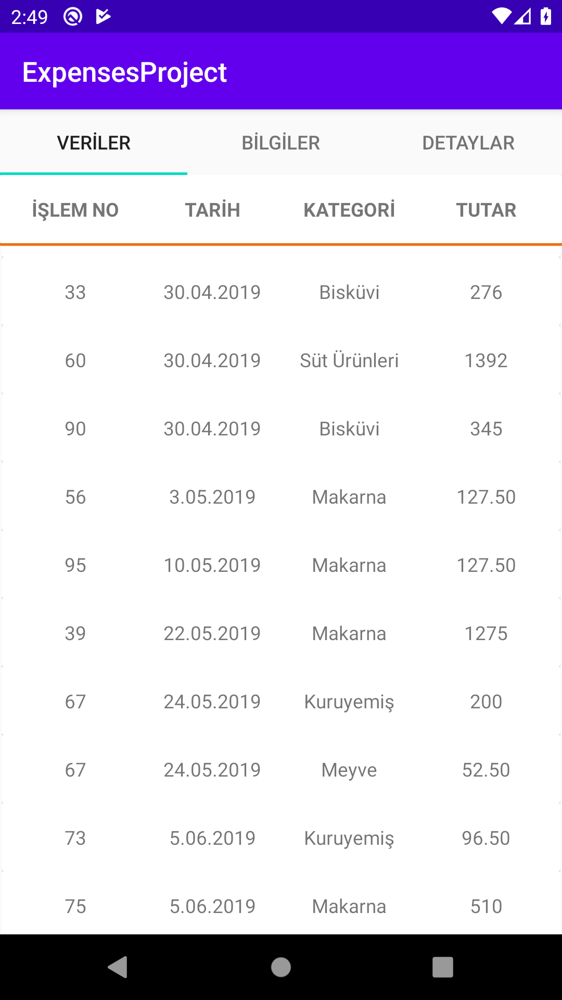
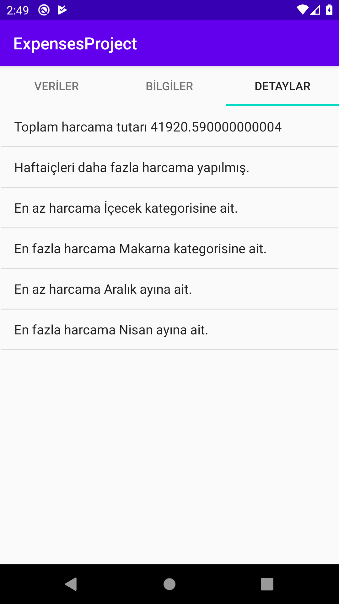

# Expenses Mobile
-------
Android application of [expenses-project](https://github.com/nejdetkadir/expenses-project).
<<<<<<< HEAD
[Download](docs/app.apk) APK.
# Screenshoots from application
=======
# Screenshots from application
>>>>>>> 81dfa1807489afd1e4968cfada4c37da23b6c4e9
-------



# Used API
-------
[API](https://api.nejdetkadirbektas.com/expenses/) 
Simple response :
```json
[
 {
    "id": "74",
    "date": "8.01.2019",
    "category": "Makarna",
    "price": "510.50"
  },
  {
  }
]
```
